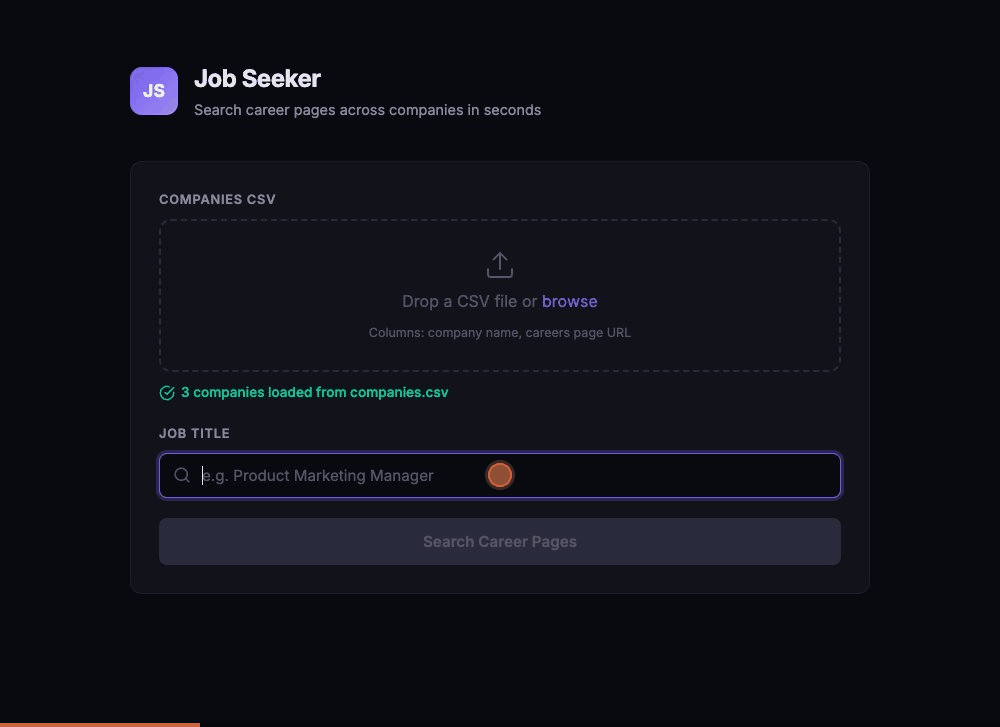

# Job Seeker

Search career pages across multiple companies for specific job listings in seconds.

Upload a CSV file with company names and their career page URLs, enter a job title, and the app scrapes each page to find matching positions — returning the position name, company, and a direct link to apply.



## How it works

1. **Upload a CSV** with two columns: company name and careers page URL
2. **Enter a job title** to search for (e.g. "Product Marketing Manager")
3. **Click Search** — the app fetches each career page and finds matching listings
4. **Browse results** — each match shows the position title, company name, and a link to the job posting

The app handles both traditional HTML career pages and JavaScript-rendered pages (Ashby, Greenhouse, Lever, etc.) by extracting job data from embedded JSON.

## CSV format

```
Company,URL
Notion,https://www.notion.com/careers
Figma,https://www.figma.com/careers
RevenueCat,https://jobs.ashbyhq.com/revenuecat
```

## Getting started

```bash
npm install
npm start
```

Open [http://localhost:3000](http://localhost:3000) in your browser.

## Tech stack

- **Backend**: Node.js + Express
- **Scraping**: Cheerio (HTML parsing) + JSON extraction for JS-rendered pages
- **Frontend**: Vanilla HTML, CSS, and JavaScript
